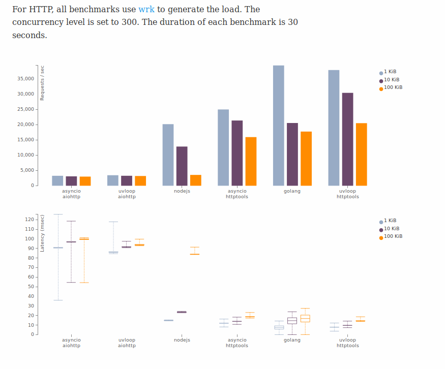

# How Things Work

This document explains how the various parts of the application works. The subjects we'll be overviewing are the following:

* The system design.
* The machine learning microservice.
* Large scale test


The reason for this design document is to make aware of how these sets of microservices work and why. To start, I'll get into the machine learning microservice.


## Service system design

The system design includes: |`node.js` server| <-> |`python` high I/O proxy server| <-> |machine learning service|

The reason for this system design is to reduce the number of calls directly to the machine learning service. If we have direct information on the node.js end, we can prevent ourselves from touching the I/O proxy server. If data is not in the correct format, or needs to be slightly modified prior to being used by the machine learning model, it can happen via the proxy service or filtered out. The end result is that the user experiences reasonable response times, and only getting `50-100ms` slowdowns when the user is getting a pair of sneakers nobody has voted on before.


#### The proxy system is moderately faster than both node.js and around the speed of go.




## Machine Learning Microservice

To appropiately handle online learning, we need to handle online regressions appropiately appropiately. This means the model updates per data point instead of training it once and calling it a day.

I'm using a library I created to host these models called `funguauniverse` it's a pypi library I used to create full online machine learning pipelines and deploy online, non-static models in as little as `3-4 hours` using python. 

The non-static model is periodically saved inside of storage and is assigned meta-data according to what the user sets. The metadata is stored inside of `mongodb`. The reason it's stored inside of mongodb is so one can dynamically create schemas and use them. The key element to the schema is that the docuement must include a `type` and `timestamp`. These are both constraints using the `funtime` database library, which I also created, where the user can do timeseries queries quickly on mongodb. 

The timeseries query is done using the `timestamp`, and the `type` is an explicit entity identifier. It must be there so we can find all documents of its entity class.

The `funtime` database can help with a lot more specialized timeseries queries as well. It has a lot of the functionality of `influxdb`.


## The Gist
The idea is that the model that's getting trained in live is stored inside of a hash table and is periodically stored inside of storage. The hash table is holds any form of data that needs to be quickly accessed. For this example, the data that's stored in memory are the scalars (evening out data), the model itself, and the list of makes to fully partital_fit the labels using sklearn's `LabelEncoder`, as it doesn't have any partial fit capabilities. Every 1 minute, the data is stored into storage (local or s3 depending on the settings) with the associated data. It does this using a `background thread`.

The data itself is referenced by hash. The hash is generated using a `dict`, which is an object to identify the model we want to work with. The dictionary we use to identify the data is also the metadata we use to locate the most recent model inside of our mongodb database.


This design is single machine right now, though it'll be very easy to replace the hash-table from a pythonic `dict` and replace it using `redis`. Where the machine learning model would be periodically updated and stored to redis as a replacement for memory. That way the model would be accessible from multiple machines inside of a docker cluster (perhap managed by `kubernetes`). Redis would then be a foundation for scaling between many machines. The machines themselves would take turns updating and sharing stuff via hash. 

The means of access is done using the client.py file. It pickles file inputs then transports the data into the model. The pickled information itself can be of any serializable data type. Including `numpy arrays`, or pandas `dataframe`. If the data is extremely large it should be pulled from a large web source, then processed on. Otherwise, all extremely small data `< 500MB` can be sent through the http interface. GZip can be used to pass more data through faster.


Because we're storing all models inside of the local store, if the server dies, and restarts, we can pull that model in from memory and continue from where we left off.

**All of the code can be seen in mlearn_server**

## Larger Scale Test

To test the services we generate statistically relevant data, we have to generate polynomials and generate random data along those polynomials. We do that for both years and the make of shoes (such as nike or adidas).

Those polynomials are used to determine the `mu` (mean) and `sigma` per year and make. Mu is simply the mean, and sigma is the standard deviation from the mean. From those numbers I'm able to generate numbers between 1 and 5.

The generated data is then used to create average swings of pricing.

### Wait but why?

Well, the various combinations of year and make true value scores will give the machine the opprotunity to find statistical relevance. On average, if I can find a probability distribution of the number of 1s, 2s, 3s, 4s, and 5s, I can assign the numbers to the training data in live via generation, and the data would entirely fit hypothetical situations.

To figure out the distribution, I take the closest rounded data and figure out which heavy combination of numbers repeats itself and yields that specific result. That's done via combinatorics:

#### The polynomial generation code
```py
makes = ["adidas", "nike", "new_balance", "asics", "kering", "skechers", "fila", "bata", "burberry", "vf_corporation"]
    
    polynomial = GetPoly(
        x=[0, 1, 2, 3, 4, 5, 6, 7, 8, 9, 10, 11, 12, 13, 14, 15, 16, 17, 18, 19], 
        y=[6, 4, 2, 2, 4, 5, 4, 4, 3, 0, 0, 0, 0, 0, -1, -2, -1, -2, 0, -1], 
        deg=2
    )

    std_poly = GetPoly(
        x=[0, 1, 2, 3, 4, 5, 6, 7, 8, 9, 10, 11, 12, 13, 14, 15, 16, 17, 18, 19], 
        y=[1, 1, 2, 2, 2, 3, 2, 1, -1, 0, 0, 0, 1, 2, 2, 3, 2, 1, 0, 0], 
        deg=2
    )

    makes_len = len(makes)
    make_range = np.arange(makes_len)

    make_uniform = np.random.uniform(size=(makes_len,))

    make_polynomial = GetPoly(
        x=make_range,
        y=((make_uniform*make_uniform) + make_uniform), 
        deg=2
    )

    make_std_poly = GetPoly(
        x=make_range, 
        y=(((make_uniform*make_uniform) + make_uniform) * (make_uniform*random.uniform(-2, 2) + random.uniform(0, 3))), 
        deg=2
    )
    
    y = polynomial.get_y(np.arange(-3, 63)).reshape(-1, 1)
    std_y = std_poly.get_y(np.arange(-3, 63)).reshape(-1, 1)
    
    makes_data = ((make_polynomial.get_y(np.arange(-2, makes_len+3))[1:makes_len+1]) * 3).reshape(-1, 1)
    scaled_make = one_point_to_five_scalar.fit_transform(makes_data)[:, 0].tolist()
    # let's shuffle it
    shuffled = random.sample(scaled_make, len(scaled_make))
    
    transformed = minimax.fit_transform(y)[:, 0]
    transformed_std = std_minmax.fit_transform(std_y)[:, 0]
    
    true_score_std_by_year = transformed_std[2:62]
    true_score_by_year = (transformed[2:62]) + 3
    
    true_mu_std = {}

    fake_year_frame = pd.DataFrame({
        "year": [],
        "year_mu":[],
        "year_sigma": [],        
    })

    fake_make_frame = pd.DataFrame({
        "make": [],
        "make_mu": [],
        "make_sigma": [],
    })
    true_score_by_year = random.sample(true_score_by_year.tolist(), len(true_score_by_year)) 
    for index, value in enumerate(true_score_by_year):
        mu = true_score_by_year[index]
        sigma = true_score_std_by_year[index]
        
        year = (1960+index)

        fake_year_frame = fake_year_frame.append({
            "year": int(year),
            "year_mu": mu,
            "year_sigma": sigma
        }, ignore_index=True)
        # true_mu_std[year] = {
        #     "mu": mu,
        #     "sigma": sigma
        # }
    

    for index, item in enumerate(shuffled):
        fake_make_frame = fake_make_frame.append({
            "make": makes[index],
            "make_mu": item,
            "make_sigma": 0.1 + random.normalvariate(0.1, 0.05)
        }, ignore_index=True)
```

#### Combinatorics Code


```py
numbers = [1, 2, 3, 4, 5, 1, 2, 3, 4, 5, 1, 2, 3, 4, 5, 1, 2, 3, 4, 5]

    dval = {}
    
    for number in dedup:
        avg = number
        result = [seq for i in range(len(numbers), 0, -1) for seq in itertools.combinations(numbers, i) if average(list(seq)) == avg]
        combination_count = {
            1: 0,
            2: 0,
            3: 0,
            4: 0,
            5: 0
        }
        for combination in result:
            for ind in combination:
                combination_count[ind] = combination_count[ind] + 1
        print(combination_count)
        dval[avg] = combination_count
```


## Code Run In Action

